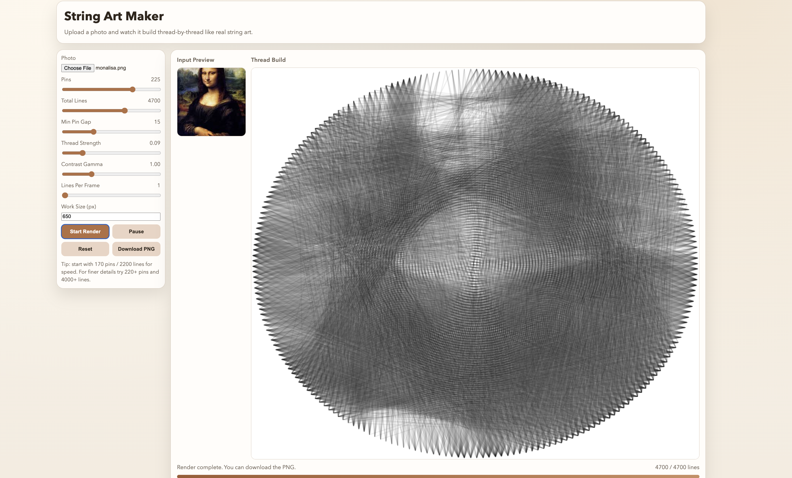

# String Art Maker

Create string-art style portraits from photos in two ways:

- Web app: upload a photo and watch the artwork build line-by-line.
- Python script: generate a final static output image from the command line.



## Features

- Circular pin-based string-art generation
- Gradual thread animation in browser
- Adjustable controls (`pins`, `lines`, `line strength`, `gamma`, `speed`, `work size`)
- Export final render as PNG

## Project Structure

```text
string_art_maker/
├── string_art_web.html
├── string_art_web.css
├── string_art_portrait.py
├── requirements.txt
└── docs/
    └── images/
```

## 1) Run the Web App

From project root:

```bash
# If you're not already inside the repo:
cd string_art_maker
python3 -m http.server 8000
```

Open:

- `http://localhost:8000/string_art_web.html`

### Web App Usage

1. Upload an image.
2. Adjust settings if needed.
3. Click `Start Render`.
4. Use `Pause` / `Resume` as required.
5. Click `Download PNG` when complete.

### Recommended Starting Settings

- Pins: `170`
- Total Lines: `2200`
- Min Pin Gap: `12`
- Thread Strength: `0.15`
- Gamma: `1.10`
- Work Size: `760`

## 2) Run the Python Script

Create and activate a virtual environment:

```bash
# If you're not already inside the repo:
cd string_art_maker
python3 -m venv .venv
source .venv/bin/activate
pip install -r requirements.txt
```

Generate output:

```bash
python3 string_art_portrait.py \
  --input "your_photo.jpg" \
  --output "string_art_output.png" \
  --pins 240 \
  --lines 3200 \
  --size 900 \
  --min-pin-gap 18 \
  --line-strength 0.14 \
  --gamma 1.1
```

## Script Options

- `--input`: input image path (required)
- `--output`: output PNG path (default: `string_art_output.png`)
- `--size`: working square size in pixels
- `--pins`: number of virtual pins on circle
- `--lines`: number of lines to draw
- `--min-pin-gap`: minimum distance between pins
- `--line-strength`: darkness effect per line
- `--gamma`: tonal curve adjustment
- `--invert`: invert tonal mapping for dark-background inputs

## Fork and Try

If anyone wants to try this project from their own GitHub account:

1. Open this repository on GitHub.
2. Click `Fork` to create a copy under their account.
3. Clone the fork locally:

```bash
git clone https://github.com/<your-username>/<forked-repo>.git
cd <forked-repo>
```

4. Run the web app:

```bash
python3 -m http.server 8000
```

Open `http://localhost:8000/string_art_web.html`

5. Optional: run the Python script version:

```bash
python3 -m venv .venv
source .venv/bin/activate
pip install -r requirements.txt
python3 string_art_portrait.py --input "your_photo.jpg"
```

## Notes

- Higher `pins` and `lines` improve detail but increase render time.
- For better portraits, use high-contrast input photos with clear faces.
- Keep the subject centered for best circular string-art composition.
